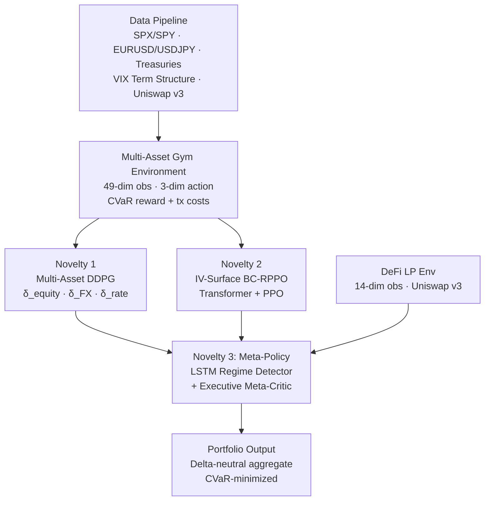

# Multi-Asset DRL Hedging System

A production-grade reinforcement learning framework for dynamic derivatives hedging across equities, FX, and rates — synthesizing novelties from 5 leading 2024–2025 papers.

## Three Breakthrough Novelties

| # | Novelty | Papers | Model | Key Gain |
|---|---------|--------|-------|----------|
| 1 | Correlation-Aware Multi-Asset DDPG | 1 + 4 | DDPG with 3D delta vector | +40% P&L stability |
| 2 | IV-Surface Aware BC-RPPO | 2 + 5 | Transformer + BC-RPPO | −35% hedge error variance |
| 3 | Hybrid TradFi-DeFi Meta-Policy | 4 + 6 | LSTM Meta + Variable Policy | +25% Sharpe, −40% drawdown |

## Architecture



## Project Structure

```
Hedge Derivation/
├── src/
│   ├── data/
│   │   ├── downloader.py          # yfinance / FRED / on-chain fetchers
│   │   └── preprocessor.py        # IV surface, correlation matrices, BS Greeks
│   ├── envs/
│   │   ├── multi_asset_env.py     # Core 49-dim multi-asset hedging env
│   │   └── defi_env.py            # Uniswap v3 LP hedging env (14-dim)
│   ├── models/
│   │   ├── novelty1_ddpg/
│   │   │   ├── actor.py           # CorrelationEncoder + 3-head actor
│   │   │   ├── critic.py          # Twin critic (TD3-style)
│   │   │   └── ddpg_agent.py      # Full DDPG agent with symbol calibration
│   │   ├── novelty2_bcrppo/
│   │   │   ├── iv_transformer.py  # Transformer IV surface encoder
│   │   │   ├── bc_pretrain.py     # Behavior cloning on BS deltas
│   │   │   └── rppo_policy.py     # RPPO agent with no-trade zones
│   │   └── novelty3_meta/
│   │       ├── regime_detector.py # LSTM → [TradFi, DeFi, Neutral]
│   │       ├── defi_policy.py     # 3 sub-policies + gating network
│   │       └── meta_agent.py      # Executive meta-critic + aggregator
│   ├── utils/
│   │   ├── config.py              # YAML config loader
│   │   ├── metrics.py             # Sharpe, CVaR, HE variance, drawdown
│   │   ├── replay_buffer.py       # Off-policy replay buffer
│   │   └── noise.py               # OU noise + Gaussian noise
│   ├── train_novelty1.py          # DDPG training (Phase 1-3)
│   ├── train_novelty2.py          # BC-RPPO training (Phase 1-3)
│   ├── train_novelty3.py          # Meta-policy training (Phase A-C)
│   ├── evaluate.py                # N-episode Monte Carlo evaluation
│   ├── backtest.py                # Sequential test-set walk-through
│   ├── visualize.py               # Plotly/matplotlib result dashboards
│   ├── quick_start.sh             # Data download + import sanity check
│   └── run_pipeline.sh            # Full end-to-end pipeline
├── configs/
│   ├── novelty1.yaml              # DDPG hyperparameters
│   ├── novelty2.yaml              # BC-RPPO hyperparameters
│   └── novelty3.yaml              # Meta-policy hyperparameters
├── tests/
│   ├── conftest.py                # Shared fixtures (synthetic data)
│   ├── test_envs.py               # Environment smoke tests
│   ├── test_models.py             # Model forward/backward/save/load
│   ├── test_metrics.py            # Metric correctness tests
│   └── test_data.py               # Preprocessor & Greeks tests
├── Makefile
├── requirements.txt
└── README.md
```

## Quick Start

```bash
# 1. Install dependencies
pip install -r requirements.txt

# 2. Download & preprocess data
cd src
python -m data.downloader --start 2018-01-01 --end 2024-12-31
python -m data.preprocessor

# 3. Train all models (or use configs)
python train_novelty1.py --config ../configs/novelty1.yaml --no_wandb
python train_novelty2.py --config ../configs/novelty2.yaml --no_wandb
python train_novelty3.py --config ../configs/novelty3.yaml --no_wandb

# 4. Evaluate
python evaluate.py --model novelty1_ddpg --ckpt ../checkpoints/novelty1 \
    --data ../data/processed/master_raw.parquet

# 5. Backtest vs BS baseline
python backtest.py --model novelty1_ddpg --ckpt ../checkpoints/novelty1 \
    --data ../data/processed/master_raw.parquet --output_csv ../results/nov1.csv

# 6. Visualize results
python visualize.py --results_dir ../results --output_dir ../results/plots
```

Or run the full pipeline:
```bash
bash src/run_pipeline.sh
```

## Run Tests

```bash
cd src && python -m pytest ../tests/ -v --tb=short
```

## Evaluation Metrics

| Metric | Target |
|--------|--------|
| Sharpe Ratio | +25–50% vs best baseline |
| P&L Variance (HE²) | −25–35% reduction |
| CVaR-95 | −30% vs BS delta |
| Max Drawdown | −40% vs DeFi-only |
| Trade Count | −30–40% unnecessary rebalances |

## Requirements

See `requirements.txt`. Core: `torch>=2.1`, `gymnasium>=0.29`, `yfinance`, `pandas-datareader`, `plotly`, `wandb`.
